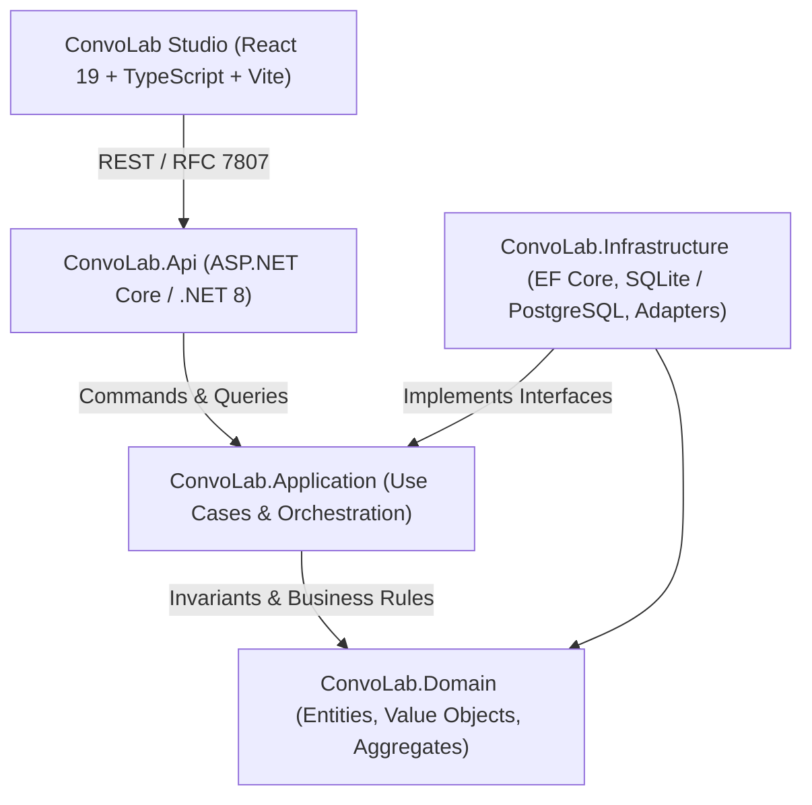

# ConvoLab: Comprehensive System & Architecture Deep-Dive

## 1. Executive Summary & Purpose

**ConvoLab** is an enterprise-grade Conversational AI Engineering & Orchestration Platform. Rather than being a simple chatbot interface or an OpenAI wrapper, ConvoLab is designed to be a **provider-neutral, governable foundation** where enterprise teams can:
- Model conversations, workflows, and prompts with strict versioning and approval lifecycles.
- Execute conversational logic with runtime safety policies, token/cost budgets, retry, and fallback strategies.
- Observe, trace, record, evaluate, replay, and benchmark AI outputs against golden standards and custom scorecards.
- Manage multi-tenancy, workspaces, RBAC, service accounts, and enterprise identity (Local, Entra ID / OIDC, Hybrid).

---

## 2. Core Architectural Pillars



### Dependency Inversion & Isolation Invariants
1. **Domain Isolation:** `ConvoLab.Domain` has **zero** dependencies on UI, web frameworks, or third-party SDKs. It defines pure aggregates, value objects, domain events, and state transitions.
2. **Separation of Concerns:**
   - **Conversation Engine** tracks turns, history, messages, and state — it *never* selects models or invokes LLM APIs directly.
   - **Intelligence Engine** plans provider execution, handles token budgets, retries, and fallbacks — it *never* renders user prompts.
   - **Prompt Engine** governs templates, variables, versioning, and approvals — it *never* performs document retrieval.
   - **Knowledge Engine** manages collections, chunks, vector embeddings, and citations — it *never* renders prompts.
   - **Policy Center** guards admissions, budgets, and safety constraints — it *never* orchestrates conversations.

---

## 3. End-to-End Capability Breakdown

| Capability / Studio | Domain Responsibility | Frontend Studio (`web/src/pages`) | Backend API Controller |
| :--- | :--- | :--- | :--- |
| **Conversation Simulator** | Sessions, timeline, turns, participant context, memory | `ConversationSimulatorPage.tsx` | `SimulationsController.cs` |
| **Workflow Designer** | Visual graph workflows, nodes (Start, Knowledge, Prompt, Decision, Intelligence, Response, End), semantic versions, deterministic routing | `WorkflowDesignerPage.tsx` | `WorkflowStudioController.cs` |
| **Prompt Studio** | Immutable prompt versions, variable composition, approval states (Draft, InReview, Published, Archived) | `PromptStudioPage.tsx` | `PromptStudioController.cs` |
| **Knowledge Studio** | Document ingestion (PDF, DOCX, TXT, MD), chunking, retrieval testing, citations, sealed knowledge packages | `KnowledgeStudioPage.tsx` | `KnowledgeStudioController.cs` |
| **Intelligence Center** | Provider readiness, model catalogs (e.g. Gemini, Deterministic), token/cost tracking in ZAR, admissions preview | `IntelligenceCenterPage.tsx` | `IntelligenceCenterController.cs`, `IntelligenceProvidersController.cs` |
| **Policy Center** | Scope-based rules (Workspace/Environment), cost/token limits, safety gates, runtime decision logging | `PolicyCenterPage.tsx` | `PolicyStudioController.cs` |
| **Evaluation Studio** | Versioned scorecards (Groundedness, Relevance, Safety), automated test batches, human review workflows | `EvaluationStudioPage.tsx` | `ExpandedEvaluationStudioController.cs`, `LegacyEvaluationController.cs` |
| **Trace Explorer** | OpenTelemetry-aligned span waterfalls, event timelines, correlation IDs, sensitive prompt/response redaction | `TraceExplorerPage.tsx` | `TraceStudioController.cs` |
| **Replay Studio** | Immutable baseline snapshots, candidate permutations (swap model/prompt/knowledge), side-by-side metric diffs | `ReplayStudioPage.tsx` | `ReplayStudioController.cs` |
| **Plugin Center** | Governance registry for external tools, evaluators, channels, and connectors with health probes | `PluginCenterPage.tsx` | `PluginStudioController.cs` |
| **Platform Analytics** | Cost aggregation, event reconciliation, attribution, export jobs, and budget alerting | `AnalyticsPage.tsx` | `AnalyticsController.cs` |
| **Workspace & Identity** | Organisations, Workspaces, RBAC, Service Identities, Entra ID OIDC linking, Break-Glass admin | `WorkspacePage.tsx`, `LoginPage.tsx` | `AuthController.cs`, `WorkspaceIdentityController.cs`, `ExternalIdentitiesController.cs` |
| **Operations Center** | Liveness/Readiness, outbox workers, cache telemetry, secret store status | `OperationsPage.tsx` | `OperationsController.cs`, `PlatformController.cs` |

---

## 4. Current Milestone & In-Flight Work

- **Active Version:** `1.0.0-alpha.14`
- **Current Sprint / Milestone Focus:** `alpha.15 — Microsoft Entra ID, External Identities & Hybrid Authentication`
  - Adding single-tenant Entra ID OIDC support.
  - User identity linking (mapping corporate identities to internal ConvoLab subjects).
  - Break-glass emergency administrator access mechanisms.
  - Hybrid authentication mode with token revocation and session epoch validation.
- **Persistence:** SQLite for rapid local testing; PostgreSQL migrations ready for containerized / cloud deployment.

---

## 5. Directory Structure & Key Files

```text
convolab-main/
├── src/
│   ├── Api/ConvoLab.Api/                 # ASP.NET Core presentation layer, middleware, endpoints
│   ├── Application/ConvoLab.Application/ # CQRS-style commands, queries, DTOs, and interfaces
│   ├── Domain/ConvoLab.Domain/           # Entities, Value Objects, Domain Events, Invariant Rules
│   ├── Infrastructure/ConvoLab.Infrastructure/ # EF Core DbContext, Repositories, Providers, Migrations
│   └── tests/                            # Domain, Application, Architecture, and Integration Tests
├── web/                                  # ConvoLab Studio (React 19, TypeScript, Tailwind, Vite)
│   ├── src/
│   │   ├── pages/                        # Studio capability screens
│   │   ├── components/                   # Shell, Navigation, Guardrails, Modals, Shared UI
│   │   ├── contexts/                     # AuthContext, WorkspaceContext
│   │   └── services/                     # Typed API clients for Platform Core
├── docs/                                 # Architecture handbook, ADRs, Capability specifications
└── docker-compose.yml                    # Local multi-container development environment
```

---

## 6. How to Run and Verify Locally

### 1. Run the Backend API (.NET 8)
```bash
dotnet restore src/Api/ConvoLab.Api/ConvoLab.Api.csproj
dotnet run --project src/Api/ConvoLab.Api/ConvoLab.Api.csproj
```
*API runs on `http://localhost:5000` (Swagger available in Development mode).*

### 2. Run the Studio Frontend (React / Vite)
```bash
cd web
npm install
npm run dev
```
*Studio runs on `http://localhost:3000` and automatically proxies `/api` and `/health` to port 5000.*

### 3. Run Automated Tests
- **Backend Tests:** `dotnet test`
- **Frontend Unit & Browser Smoke Tests:**
  ```bash
  cd web
  npm run test -- --run
  npm run test:browser
  ```
