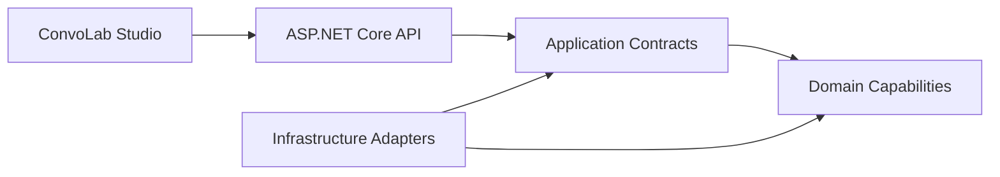

# ConvoLab Architecture Handbook v1

This handbook is the architecture baseline for Platform Core `v1.0.0-alpha` and ConvoLab Studio `v1.0.0-alpha.1`.

## Contents

- [Architecture principles](ArchitecturePrinciples.md)
- [Capability dependency matrix](CapabilityDependencyMatrix.md)
- [Public capability contracts](PublicContracts.md)
- [Architecture fitness functions](FitnessFunctions.md)
- [Product readiness assessment](ProductReadinessAssessment.md)
- [Versioning and compatibility](Versioning.md)
- [Platform manifest](../PlatformManifest.md)
- [Capability map](../CapabilityMap.md)
- [Context map](../ContextMap.md)
- [Event catalog](../EventCatalog.md)

## Baseline topology

ConvoLab has one product frontend (`web/`) and one platform backend (`src/Api`). Provider SDKs and enterprise integrations must enter through Infrastructure or plugin adapters.
