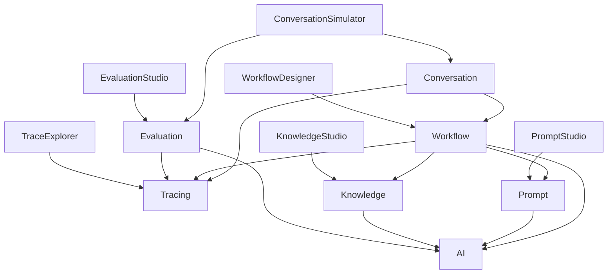

# ConvoLab Capability Map

This document visualizes the capabilities of the ConvoLab platform, categorized by their domain and level of abstraction.

## Platform Core

The foundational engines that drive the platform's runtime behavior.

*   **Conversation**: Manages multi-turn dialogue state, memory, and context.
*   **Workflow**: Orchestrates execution pipelines, state machines, and long-running processes.
*   **Prompt**: Governs the lifecycle, versioning, and rendering of prompt templates.
*   **Knowledge**: Handles document ingestion, vector storage, and semantic retrieval.
*   **AI**: Abstracts interactions with language models and external AI providers.
*   **Tracing**: Captures telemetry, token usage, and execution spans for observability.
*   **Evaluation**: Assesses response quality against predefined metrics and rubrics.
*   **Plugins**: Manages dynamic extensions and external tool integrations.

## Governance & Identity

Capabilities ensuring the platform operates securely and transparently.

*   **Identity**: Manages users, tenants, and role-based access control (RBAC).
*   **Governance**: Enforces policies on prompt usage, model access, and data privacy.

## Applications (Studios & Explorers)

User interfaces built on top of the platform core for management and analysis.

*   **Conversation Simulator**: Automates dialogue testing and scenario validation.
*   **Prompt Studio**: Visual interface for crafting, testing, and versioning prompts.
*   **Knowledge Studio**: Interface for managing document collections and vector indices.
*   **Evaluation Studio**: Dashboard for reviewing AI performance metrics and reports.
*   **Trace Explorer**: Visualizer for execution traces, latency, and token consumption.
*   **Workflow Designer**: Visual canvas for building and deploying workflows.

## Enterprise & Delivery

Capabilities for integrating and deploying ConvoLab within larger organizations.

*   **Enterprise**: Features for SSO, audit logging, and compliance reporting.
*   **SDK**: Client libraries for integrating ConvoLab into custom applications.
*   **CLI**: Command-line tools for platform management and CI/CD automation.
*   **Deployment**: Infrastructure-as-code and container orchestration definitions.
*   **Integrations**: Connectors to external enterprise systems (CRM, ERP, ITSM).

## Capability Dependencies

