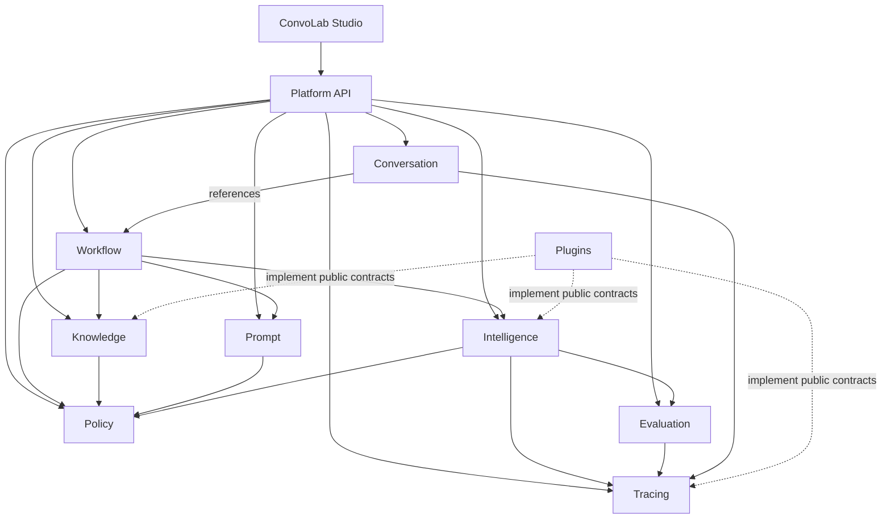

# ConvoLab Capability Map

## Platform Core

- **Conversation** — lifecycle, sessions, participants, immutable messages, context, memory, attachments, and business timeline.
- **Workflow and Execution** — reusable versioned workflow definitions, runtime executions, state transitions, cancellation, failure, and completion.
- **Prompt** — governed prompt assets, composition, variables, immutable versions, approvals, comparisons, rollback, and experiments.
- **Knowledge** — governed sources, connectors, documents, chunks, retrieval strategies, rankings, citations, snapshots, and sealed `KnowledgePackage` artifacts.
- **Intelligence** — provider-neutral execution planning, capability matching, budgets, tokens, cost, latency, retries, fallback, streaming, and tool calls.
- **Policy** — centralized governance decisions for providers, models, budgets, prompts, retrieval, safety, compliance, and tenants.
- **Evaluation** — quality, groundedness, relevance, completeness, safety, and policy scorecards.
- **Tracing** — traces, nested spans, events, metrics, artifacts, and cross-capability correlation.
- **Plugins** — provider, tool, connector, channel, evaluator, and enterprise extension contracts.
- **Identity** — future users, tenants, teams, roles, service identities, and audit actors.

## Engineering products

- ConvoLab Studio shell and dashboard
- Conversation Explorer
- Workflow Designer
- Prompt Studio
- Knowledge Studio
- Intelligence Center
- Policy Center
- Evaluation Studio
- Trace Explorer
- Replay Studio
- AI Playground
- Analytics and Operations Console

## Enterprise and delivery

- Provider adapters
- Knowledge connectors
- Channel and contact-centre integrations
- SDKs and CLI
- Deployment automation
- Governance portal
- Plugin marketplace

## Capability dependencies

The diagram represents public-contract use, not ownership of another capability's aggregates.
