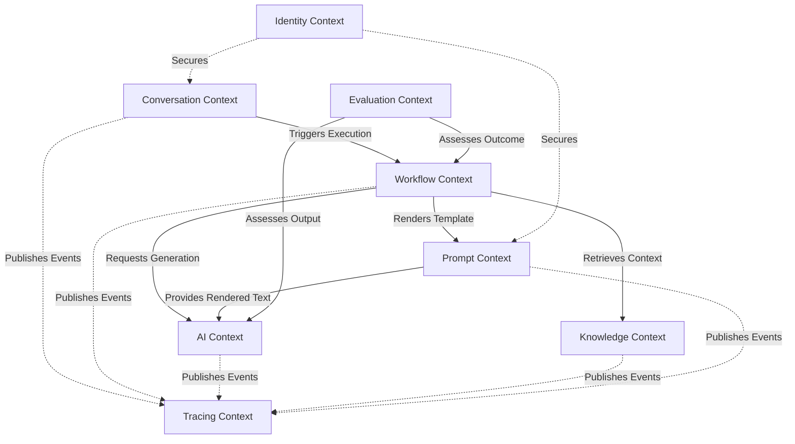

# ConvoLab Context Map

This document describes the Domain-Driven Design (DDD) Context Maps for the ConvoLab platform, illustrating how different Bounded Contexts relate and communicate.

## Core Relationships

### Conversation ↔ Workflow
The **Conversation Context** acts as the primary entry point for user interactions. It triggers executions within the **Workflow Context** to handle complex intents. The relationship is primarily event-driven and asynchronous.
*   **Relationship**: Customer-Supplier (Conversation depends on Workflow outcomes) / Event-Driven.
*   **Integration**: Conversation publishes `ConversationStarted` or `MessageReceived` events. Workflow listens and initiates an `Execution`.

### Workflow ↔ AI
The **Workflow Context** orchestrates the business logic, but delegates the actual inference and generation to the **AI Context**.
*   **Relationship**: Conformist. The Workflow context conforms to the abstraction provided by the AI context (`IAIOrchestrator`).
*   **Integration**: Direct synchronous calls via interfaces for generation, augmented by asynchronous events for status updates.

### Prompt ↔ AI
The **Prompt Context** governs the templates and parameters, while the **AI Context** consumes the rendered prompts for execution.
*   **Relationship**: Partnership. They must co-evolve, but Prompt remains provider-agnostic.
*   **Integration**: The AI context requires a rendered string or structured message array, which the Prompt engine provides via its public contracts.

### Knowledge ↔ Prompt
The **Knowledge Context** retrieves relevant context, which is often injected as variables into templates managed by the **Prompt Context**.
*   **Relationship**: Upstream-Downstream. Knowledge provides data that Prompt consumes.
*   **Integration**: Workflow often orchestrates this: it queries Knowledge, then passes the results as variables to the Prompt engine.

### Evaluation ↔ AI
The **Evaluation Context** assesses the outputs generated by the **AI Context**.
*   **Relationship**: Customer-Supplier. Evaluation consumes AI outputs to run its rubrics.
*   **Integration**: Evaluation can be triggered synchronously (as a workflow step) or asynchronously (post-execution analysis via events).

### Tracing ↔ Conversation
The **Tracing Context** records the lifecycle of a **Conversation** and its associated workflows.
*   **Relationship**: Conformist (Tracing) to Core Domains. Tracing passively observes.
*   **Integration**: Tracing listens to domain events across all contexts to build a unified trace.

## Context Map Diagram

