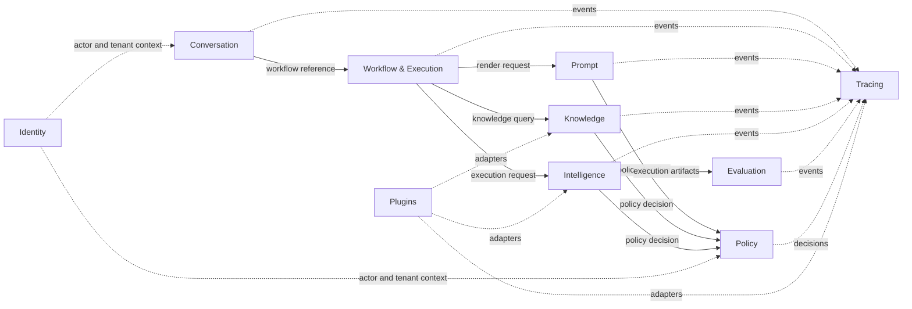

# ConvoLab Context Map

## Relationship principles

- Bounded contexts own their aggregate internals.
- Cross-context interaction uses public Application contracts, immutable references, sealed transfer artifacts, or published events.
- Provider and enterprise system models enter through anti-corruption layers in Infrastructure or plugins.

## Core relationships

### Conversation → Workflow

Conversation is a customer of Workflow. It may link workflow execution references and reflect workflow facts in its business timeline, but it never executes workflow transitions itself.

**Pattern:** Customer/Supplier with published language.

### Workflow → Prompt

Workflow requests a rendered, governed prompt through Prompt's public contract. Workflow never edits prompt internals.

**Pattern:** Customer/Supplier.

### Workflow → Knowledge

Workflow creates a business-scoped query and consumes a sealed `KnowledgePackage`. Physical retrieval remains behind Knowledge retriever adapters.

**Pattern:** Open Host Service with Published Language (`KnowledgeQuery`, `KnowledgePackage`).

### Workflow → Intelligence

Workflow supplies execution context and consumes an immutable execution result. Intelligence owns provider and model selection, budget, retry, fallback, streaming, and tool planning.

**Pattern:** Customer/Supplier with Open Host Service.

### Prompt ← Knowledge

Prompt may consume a sealed `KnowledgePackage` as a rendering input. It never queries sources or ranks chunks.

**Pattern:** Published Language.

### Intelligence → Policy

Intelligence requests explicit policy decisions before executing a plan. Policy determines what is allowed but does not execute the operation.

**Pattern:** Customer/Supplier.

### Knowledge → Policy

Knowledge requests access, classification, retention, and retrieval-policy decisions.

**Pattern:** Customer/Supplier.

### Evaluation ← Intelligence

Evaluation consumes normalized execution artifacts and applies versioned scorecards and policy thresholds.

**Pattern:** Customer/Supplier.

### Tracing observes all capabilities

Tracing consumes published facts and correlation identifiers. It does not control business progression.

**Pattern:** Conformist observer / published event subscriber.

### Plugins → Platform contracts

Plugins conform to versioned public contracts and use anti-corruption layers for vendor-specific concepts.

**Pattern:** Plugin / Open Host Service / Anti-Corruption Layer.

## Context map

