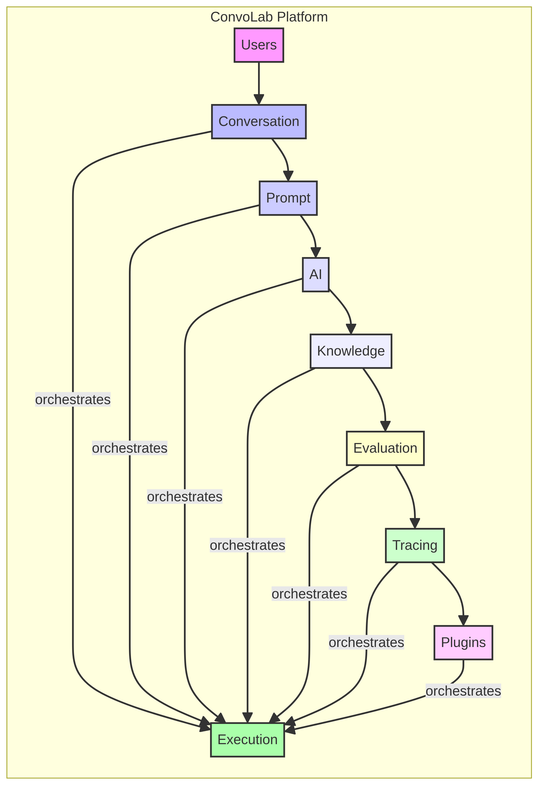
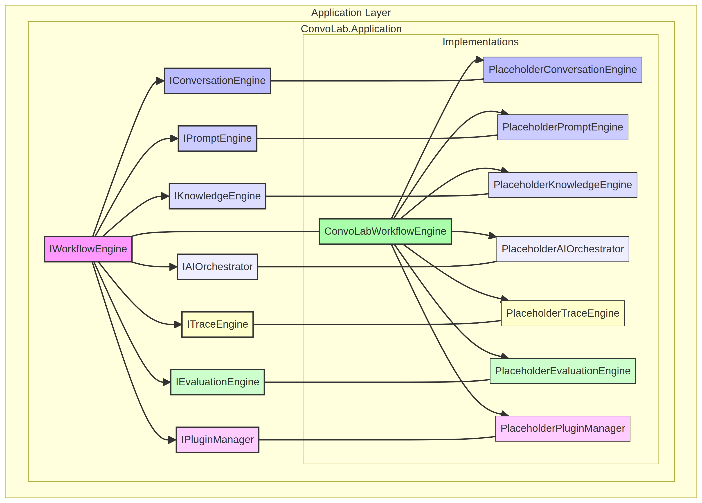
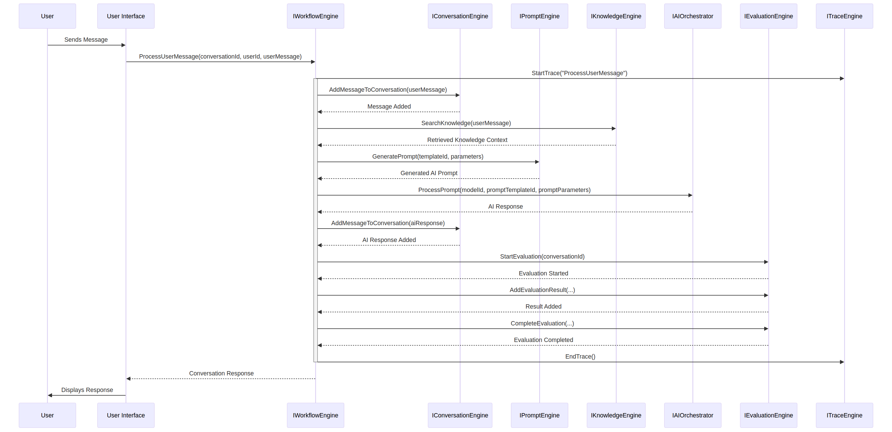
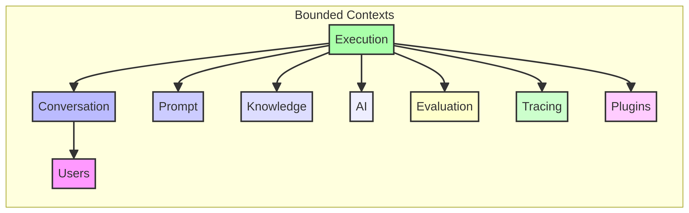
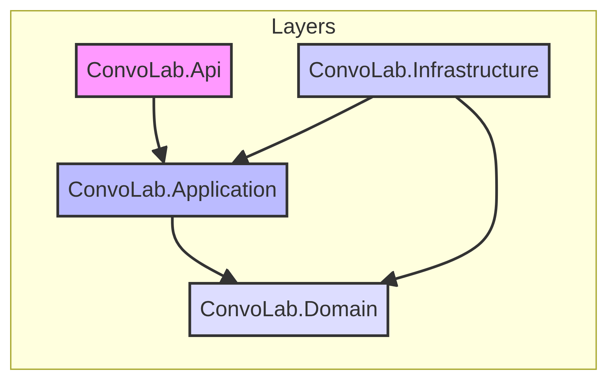

# Sprint 1 Review: The Execution Backbone

## Introduction

This document outlines the architectural enhancements and implementations completed during Sprint 1, focusing on establishing the core execution backbone for the ConvoLab platform. The primary objective was to introduce a dedicated `Execution` bounded context responsible for orchestrating every conversational request, ensuring a stable, extensible, and provider-agnostic foundation for future feature development.

## Key Achievements

### 1. Execution Bounded Context

A new bounded context, `Execution`, has been introduced within the `ConvoLab.Domain` layer. This context encapsulates the core logic for managing and orchestrating conversational AI workflows. It includes:

*   **Aggregates**: `Pipeline`
*   **Entities**: `PipelineStep`
*   **Value Objects**: `ExecutionId`, `ExecutionResult`, `ExecutionContext`
*   **Enums**: `ExecutionStatus`
*   **Interfaces**: `IWorkflowEngine`

This separation ensures clear responsibilities and enhances the modularity and extensibility of the platform.

### 2. Refined Engine Abstractions

The `Application` layer now defines a comprehensive set of interfaces for various engines, ensuring a clear contract for their responsibilities without coupling to specific implementations or external providers. These interfaces include:

*   `IConversationEngine`
*   `IPromptEngine`
*   `IKnowledgeEngine`
*   `IAIOrchestrator`
*   `ITraceEngine`
*   `IEvaluationEngine`
*   `IPluginManager`
*   `IWorkflowEngine`

Placeholder implementations for each of these interfaces have been created and registered via Dependency Injection, allowing the system to compile and run the core workflow without external dependencies.

### 3. Pipeline Model

A robust `Pipeline` aggregate has been designed to manage the lifecycle of a conversational request. It consists of `PipelineStep` entities, each representing a distinct stage in the execution flow. The `Pipeline` supports:

*   Adding steps
*   Starting, completing, failing, and canceling execution
*   Tracking duration and overall status

This model provides a structured and observable mechanism for processing requests.

### 4. Execution Context

An immutable `ExecutionContext` value object has been introduced to carry essential information throughout the pipeline. This context includes:

*   `ConversationId`
*   `UserId`
*   `TenantId`
*   `CorrelationId`
*   `CurrentPromptTemplateId`
*   `RetrievedKnowledgeContext`
*   `SelectedAIProvider`
*   `SelectedAIModelId`
*   `Metadata`
*   `ExecutionVariables`
*   `CancellationToken`

This ensures that all necessary data is available at each step of the workflow without introducing direct dependencies between engines.

### 5. Cross-Domain Events

Several cross-domain events have been defined to facilitate communication and enable reactive behaviors across different bounded contexts. These include:

*   `ExecutionStarted`
*   `ExecutionCompleted`
*   `ExecutionFailed`
*   `AIRequested`
*   `PromptRequested`
*   `KnowledgeRequested`
*   `EvaluationRequested`
*   `TraceRequested`

These events are infrastructure-agnostic and leverage MediatR for publication.

### 6. Expanded Tracing Model

The `Tracing` bounded context has been expanded to support concepts similar to modern distributed tracing. New value objects have been introduced:

*   `TraceEvent`
*   `Metric`
*   `Artifact`

This provides a richer model for capturing telemetry, enabling better observability, debugging, and performance analysis of complex, distributed workflows.

### 7. AI Orchestration Abstractions

The `AI` bounded context now includes domain models for AI orchestration, abstracting away provider-specific details. These include:

*   `AIProvider`
*   `AICompletion`
*   `TokenUsage`
*   `AICost`
*   `AIEmbedding`

These models ensure that the core application remains vendor-agnostic and can easily integrate with various AI providers in the future.

### 8. Architecture Decision Records (ADRs)

Four Architecture Decision Records have been created to document key architectural decisions made during this sprint:

*   **ADR 0001: Introduction of Execution Bounded Context**: Justifies the creation of the `Execution` context.
*   **ADR 0002: Centralized Orchestration of Conversational AI Workflow**: Explains the decision to centralize workflow orchestration.
*   **ADR 0003: Abstraction of External AI Providers**: Details the rationale behind abstracting AI providers.
*   **ADR 0004: Modeling Tracing for Distributed Systems**: Describes the expanded tracing model.

These ADRs provide a historical log of decisions and their rationale, aiding in future development and onboarding.

### 9. Mermaid Diagrams

Several Mermaid diagrams have been generated to visually represent the architecture:

*   **Context Diagram**: Illustrates the high-level bounded contexts and their relationships.
    
*   **Component Diagram**: Shows the interfaces and placeholder implementations within the Application layer.
    
*   **Execution Pipeline Sequence Diagram**: Depicts the flow of a conversational request through the `IWorkflowEngine` and various engines.
    
*   **Bounded Context Relationships**: Visualizes the dependencies between the different bounded contexts.
    
*   **Dependency Graph**: Shows the architectural layers and their allowed dependencies.
    

### 10. Architecture Tests

Architecture tests have been introduced using `NetArchTest.Rules` to enforce Clean Architecture principles and verify compliance with defined architectural rules. These tests ensure:

*   `Domain` has no dependencies on other projects.
*   `Application` has no dependencies on `Infrastructure` or `Api`.
*   `Infrastructure` has no dependencies on `Api`.
*   `Execution` interfaces reside in the `Domain` layer.

These tests provide automated validation of the architectural integrity.

## Conclusion

Sprint 1 has successfully laid down a robust and extensible architectural foundation for ConvoLab. The introduction of the `Execution` bounded context, refined engine abstractions, a comprehensive pipeline model, and an expanded tracing model, coupled with detailed documentation and architecture tests, ensures that the platform is well-prepared for future feature development and integration with various AI providers. The codebase adheres strictly to DDD and Clean Architecture principles, promoting maintainability, testability, and extensibility.
