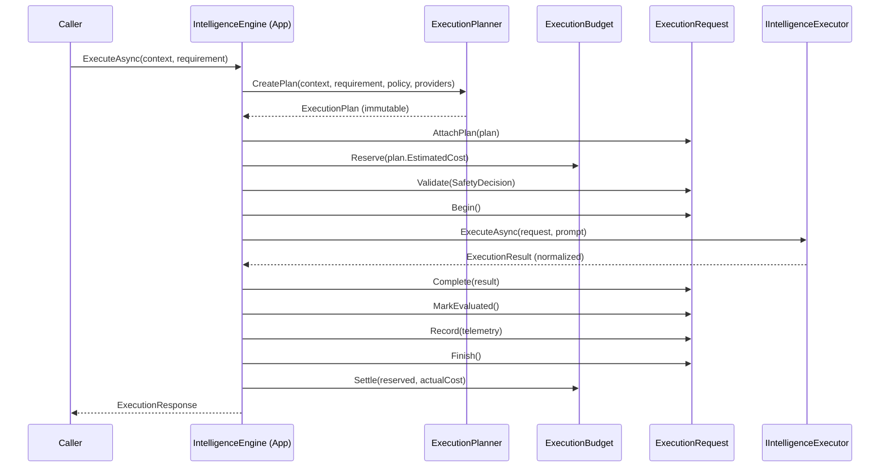

# Capability 6: Intelligence Engine

The Intelligence Engine (formerly AI Orchestrator) is the platform's single gateway to intelligent execution. It is responsible for taking a declarative statement of **what** is needed (capabilities, context, policy) and deciding **how** to execute it (provider selection, model routing, safety validation, budget reservation, tool calling, streaming, retry, fallback, and telemetry).

The Intelligence Engine is strictly provider-independent. It never leaks SDK types or wire formats to the application layer.

## Architecture

The domain is split into two bounded contexts to ensure governance rules can evolve independently of execution logic:

### 1. Policy Bounded Context
A declarative rules engine for governance.
* **`PolicyDefinition`**: An ordered set of rules over a specific domain (e.g. `ModelAccess`, `BudgetLimit`, `PromptApproval`).
* **`PolicyRule`**: A match condition and an effect (`Allow`, `Deny`, `AllowWithConstraints`).
* **`PolicyEvaluationContext`**: An opaque attribute bag describing the facts of a decision request.

Execution engines ask the Policy Engine for decisions; they never re-litigate or implement business rules themselves.

### 2. Intelligence Engine Bounded Context
The execution orchestrator.
* **`IntelligenceProvider`**: A business concept representing a provider (OpenAI, Gemini, Internal). Owns health, rate limits, and circuit breaking.
* **`IntelligenceModel`**: A model within a provider catalogue. Declares capabilities (chat, streaming, tools, vision), pricing, and context limits.
* **`ExecutionPlanner`**: A pure domain service that takes a requirement, context, and policy, and produces an immutable `ExecutionPlan`. It ranks candidates by health, latency, and estimated cost, and builds fallback chains.
* **`ExecutionRequest`**: The central aggregate managing the execution lifecycle state machine: Requested → Planned → Validated → Executing → (Streaming) → Completed → Evaluated → Recorded → Finished. Handles retry and fallback transitions.
* **`ExecutionBudget`**: A spending envelope scoped to a tenant, workflow, or conversation. Enforced at planning time (reservation) and settled at completion.
* **`IIntelligenceExecutor`**: The single infrastructure port through which real provider adapters are attached.

## Execution Lifecycle

## Resilience & Governance
* **Circuit Breaking**: Consecutive provider failures open the circuit. Open providers are excluded from planning.
* **Budgets**: An exhausted budget halts planning. Money is a domain invariant.
* **Fallbacks**: If execution fails and retries are exhausted, the engine seamlessly switches to a fallback plan (e.g. `gpt-4` fails → fallback to `gpt-3.5-turbo`) without caller intervention.
* **Safety**: Executions are validated against a safety pipeline before a single token reaches a provider.
