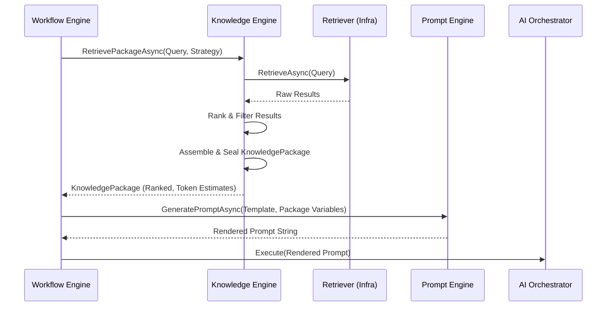

# Capability 5: Knowledge Engine

**Status:** Implemented (Domain & Application Layer)  
**Domain:** `ConvoLab.Domain.Knowledge`

The **Knowledge Engine** is the single source of truth for enterprise knowledge retrieval within ConvoLab. It governs how organizational knowledge is discovered, chunked, versioned, retrieved, and delivered to conversational workflows.

Crucially, the Knowledge Engine is **infrastructure-agnostic**. It does not know about vector databases, embedding models, or specific search indices. It models the *enterprise capability* of knowledge governance.

## Core Concepts

*   **Knowledge Source**: A governed origin of information (e.g., a SharePoint site, an API, a SQL database). Owns documents and dictates the governing policy.
*   **Knowledge Collection**: A logical grouping of sources scoped to a business purpose (e.g., "Claims Policies"). The boundary for retrieval queries and snapshots.
*   **Knowledge Document**: A governed asset ingested from a source. Follows a strict lifecycle (Draft → Approved → Published → Deprecated → Archived). Published documents are immutable; changes yield new versions.
*   **Knowledge Chunk**: A retrievable unit of a document. May carry an opaque reference to an external embedding.
*   **Knowledge Connector**: The plug-and-play bridge to the origin system. Models capabilities, sync schedules, and health, but delegates physical sync to infrastructure.
*   **Knowledge Package**: The sealed, governed output of a retrieval operation. **This is the only artifact the Prompt Engine may consume.** It carries results, citations, ranking, confidence, and token estimates.

## Retrieval Strategy & Ranking

Workflows query the Knowledge Engine using a **Retrieval Strategy** (Keyword, Semantic, Hybrid, Policy-based). The engine delegates physical search to an `IKnowledgeRetriever` implementation, then applies domain ranking rules to the results:

1.  Filters out results below the strategy's `MinConfidence`.
2.  Orders by `KnowledgeRanking` (highest relevance first).
3.  Caps at `MaxResults`.
4.  Ensures `Citations` are attached if required.
5.  Seals the results into a `KnowledgePackage`.

## Integration with Prompt Engine

The Knowledge Engine and Prompt Engine are strictly decoupled:
1.  Workflow requests knowledge via `IKnowledgeEngine.RetrievePackageAsync`.
2.  Knowledge Engine returns a sealed `KnowledgePackage`.
3.  Workflow passes the package's content/citations as variables to `IPromptEngine.GeneratePromptAsync`.
4.  The Prompt Engine can use `package.FitToTokenBudget(budget)` to safely trim context.

## Domain Events

The Knowledge Engine emits rich domain events for the Tracing and Evaluation engines to observe:
*   `KnowledgeIndexedEvent`
*   `KnowledgeVersionPublishedEvent`
*   `KnowledgeRetrievedEvent`
*   `KnowledgePackageCreatedEvent`
*   `ConnectorSynchronizedEvent`

## Diagram: Knowledge Retrieval Sequence

