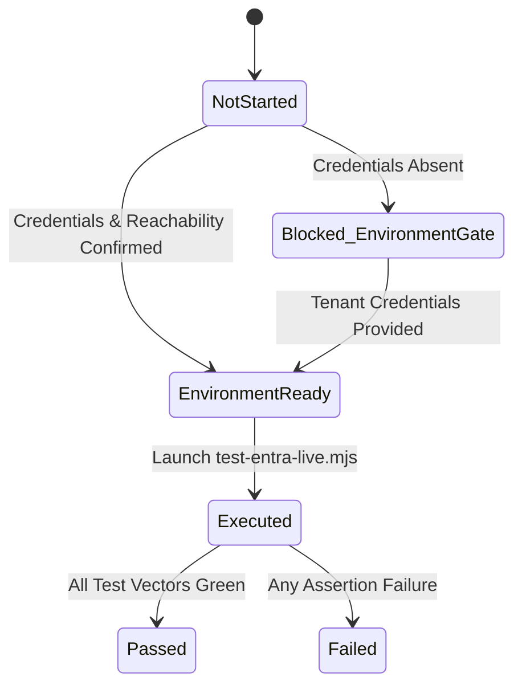

# ConvoLab Operational Acceptance Protocol — Microsoft Entra ID Live Tenant

This protocol defines the formal, deterministic acceptance verification procedure for integrating ConvoLab with a live Microsoft Entra ID (Azure Active Directory) corporate or testing tenant.

## 1. Acceptance States & State Transitions

The acceptance status of Entra ID live integration must be explicitly classified into one of the following canonical states:

| State | Definition | Gate Condition |
| :--- | :--- | :--- |
| **Not Started** | Protocol defined, but no rehearsal or execution attempted. | Initial state. |
| **Environment Ready** | Target tenant, app registration, client credentials, and network connectivity are verified. | Environment variables present and tenant OpenID configuration reachable. |
| **Executed** | Full or partial test suite run against the live tenant. | OIDC exchange initiated. |
| **Passed** | All functional, authorization, lifecycle, and negative security test cases passed. | Zero test failures, audit logged, evidence cryptographically verifiable. |
| **Failed** | One or more test cases failed (e.g. invalid claims, token rejection, role misconfiguration). | Any assertion failure. |
| **Blocked (Environment Gate)** | Live credentials or tenant access are not available in current environment. Mock/stub validation passed, but live acceptance is deferred until corporate access is granted. | Missing `CONVOLAB_ENTRA_*` configuration. |

---

## 2. Environment Configuration Requirements

When executing against a live tenant, the following configuration parameters are required (supplied securely via environment variables, never committed or logged):

* `CONVOLAB_ENTRA_TENANT_ID`: The GUID representing the Microsoft Entra tenant ID.
* `CONVOLAB_ENTRA_CLIENT_ID`: The Application (Client) ID registered in Entra.
* `CONVOLAB_ENTRA_CLIENT_SECRET`: A valid client secret with appropriate permissions.
* `CONVOLAB_TARGET_URL`: The origin URL of the running ConvoLab API instance (e.g. `http://localhost:5000`).
* `CONVOLAB_ENTRA_REDIRECT_URI`: Registered redirect URI (default: `{CONVOLAB_TARGET_URL}/signin-oidc`).

> [!IMPORTANT]
> In normal CI/CD pipelines and local development environments without a live corporate tenant, the verification runner detects the absence of these variables and deterministically reports `Blocked (Environment Gate)`. It must **never** fail the normal build or forge a false pass.

---

## 3. Deterministic Validation Areas & Vectors

### 3.1 Authentication

1. **OIDC Authorization-Code Flow with PKCE**:
   * API initiates challenge to `https://login.microsoftonline.com/{TenantId}/oauth2/v2.0/authorize`.
   * Enforces `code_challenge` (S256) and `code_challenge_method=S256`.
   * Verifies state parameter to prevent CSRF.
2. **Nonce Validation**:
   * Emits cryptographically random `nonce` in authorization request.
   * Confirms `nonce` claim in ID token strictly matches request cookie.
3. **Issuer & Signature Validation**:
   * Token signature verified using keys published at `https://login.microsoftonline.com/{TenantId}/discovery/v2.0/keys`.
   * `iss` claim must equal `https://login.microsoftonline.com/{TenantId}/v2.0`.
4. **Tenant ID Validation**:
   * `tid` claim matches `CONVOLAB_ENTRA_TENANT_ID`.
5. **Session Creation**:
   * Upon successful token exchange, generates an opaque server-side session.
   * `AuthenticationProvider` set to `"Entra"`.
   * Session token issued in hardened HTTP cookie (`HttpOnly`, `SameSite=Lax`, `Secure`).
6. **Sliding & Absolute Expiration**:
   * Session slides on active use up to absolute window (8 hours).
   * Absolute expiration forces re-authentication.
7. **Logout & Token Revocation**:
   * Invoking `/api/auth/logout` invalidates the server-side session record.
   * Redirects client to Entra `end_session_endpoint` if configured.
8. **External Identity Mapping**:
   * Maps Entra subject (`sub`) and tenant (`tid`) to ConvoLab `ExternalIdentity` entity.

### 3.2 Authorization & Tenant Isolation

1. **Platform Administrator Role**:
   * Verified by membership in designated Entra security group or explicit app role assignment (`Roles = ["PlatformAdministrator"]`).
   * Grants access to Operations, Audit export, and Policy management.
2. **Member Role**:
   * Standard authenticated user access to authorized workspaces.
3. **Workspace Isolation**:
   * Confirms user cannot query or mutate resources outside their assigned `ActiveWorkspaceId`.
   * Cross-tenant query attempts return HTTP 403 Forbidden.
4. **Protected Routes**:
   * All `/api/*` administrative endpoints reject unauthenticated or unprivileged tokens.
5. **Audit Authorization**:
   * `/api/audit` query and export endpoints strictly restricted to `PlatformAdministrator`.

### 3.3 Identity Lifecycle

1. **First-Time Login**:
   * If user does not exist in local database and open enrollment is disabled, authentication returns structured invitation requirement.
2. **Single-Use Invitation Linking**:
   * Invitation token generated by Platform Administrator.
   * User logs in via Entra with invitation cookie attached.
   * ConvoLab creates user and links external identity (`Provider = "Entra"`, `Issuer`, `Subject`).
   * Invitation token is immediately burned and marked consumed.
3. **Duplicate Prevention**:
   * Attempting to link an already-linked Entra identity returns structured 409 Conflict.
4. **Disablement & Revocation**:
   * When an identity is disabled in ConvoLab (`IsActive = false`), active sessions are terminated immediately and subsequent logins fail.

### 3.4 Break-Glass Fallback

1. **Dedicated Endpoint**:
   * `/api/auth/break-glass` available even when Entra provider is degraded or misconfigured.
2. **Local Administrator Requirement**:
   * Requires configured break-glass credentials.
3. **Dedicated Session Lifetime**:
   * Strict 15-minute max session lifetime without sliding extension.
4. **Strict Rate Limiting**:
   * Hard rate limit (e.g. 3 attempts per 15 minutes) with IP tracking.
5. **Dedicated Audit Trail**:
   * Every break-glass attempt (success or failure) generates a high-severity audit log entry.

### 3.5 Negative Security Verification

| Vector | Injected Flaw | Expected System Response | Status Code |
| :--- | :--- | :--- | :--- |
| **Invalid Issuer** | Token signed with untrusted STS or consumer tenant. | Token validation failure; no session created. | 401 / Redirect to error |
| **Invalid Audience** | Token issued for a different client ID. | Token rejected (`authentication.entra.claims_invalid`). | 401 Unauthorized |
| **Missing Nonce** | Id token payload omitting nonce parameter. | Rejection by OIDC middleware (`remote_failure`). | 400 Bad Request |
| **Expired Token** | Expired JWT timestamp. | Immediate rejection. | 401 Unauthorized |
| **Tenant Mismatch** | Token from unapproved Azure AD tenant. | Tenant filter aborts session initialization. | 401 / 403 |
| **Disabled Identity** | Valid token for user marked disabled in ConvoLab. | Authentication rejected (`UserDisabledException`). | 403 Forbidden |
| **Insufficient Role** | Member user accessing `/api/audit`. | RBAC rejection. | 403 Forbidden |

---

## 4. Acceptance Evidence Artifacts

Upon execution, the verification script `scripts/operations/test-entra-live.mjs` generates:

1. **Console Output**: Human-readable test execution log with masked credentials.
2. **Machine-Readable Evidence**: JSON report written to `docs/reports/entra-live-evidence.json` (or passed via stdout) containing:
   * Execution timestamp (ISO-8601 UTC).
   * Target endpoint / authority URI (tenant ID redacted to first/last 4 chars).
   * Detailed test vector results (Status, Latency, Diagnostic message).
   * Final verdict (`Passed`, `Failed`, or `Blocked (Environment Gate)`).
