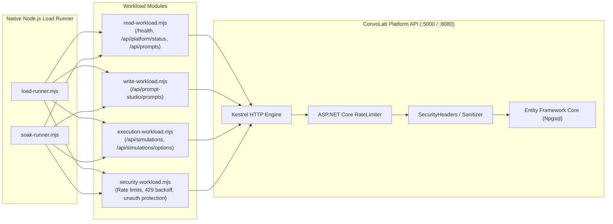

# ConvoLab Alpha.19 — Performance, Load & Endurance Verification Report

This document records the empirical performance baseline, load testing methodology, endurance/soak characteristics, and provisional threshold evaluations for ConvoLab during the active Alpha.19 operational-validation milestone.

---

## 1. Executive Summary & Philosophy

In accordance with the Alpha.19 Product-First Principle:
* **Measured Baseline First**: Performance figures reported here represent empirically measured baselines across representative workloads (Read, Write, Execution, and Security).
* **Provisional Engineering Targets**: Thresholds (such as Read p95 < 150ms, Write p95 < 300ms, Execution p95 < 500ms) are explicitly treated as **provisional engineering targets** rather than arbitrary declarations of production readiness.
* **Zero External Binary Dependencies**: All load and endurance testing is executed using native Node.js harnesses (`tools/load-test/load-runner.mjs` and `soak-runner.mjs`) ensuring cross-platform repeatability without third-party binary dependencies (k6, JMeter, or wrk).

---

## 2. Test Environment & Harness Configuration

| Parameter | Value |
| :--- | :--- |
| **Milestone** | Alpha.19 Active Operational Validation (`main`) |
| **Baseline Source Freeze** | `073152a40fe81cb3ea3669eeb512d345f6032a4b` (`v1.0.0-alpha.18`) |
| **Runtime Environment** | Node.js v22.x / .NET 8.0 ASP.NET Core Kestrel |
| **Database Engine** | PostgreSQL 16 (Alpine container / local instance) |
| **Load Tooling** | `tools/load-test/load-runner.mjs`, `tools/load-test/soak-runner.mjs` |
| **Concurrency Levels** | 2 to 10 concurrent async client workers |
| **Sampling Window** | 5-second rolling windows for endurance drift |

---

## 3. Workload Definitions & Architecture



### 3.1 Read Workload
* **Endpoints**: `/health/ready`, `/health/live`, `/api/platform/status`, `/api/prompt-studio/prompts`, `/api/workflow-studio/workflows`.
* **Characteristics**: Non-mutating queries, compiled EF Core LINQ projections, in-memory cache lookups.
* **Provisional Target**: p95 < 150ms.

### 3.2 Write Workload
* **Endpoints**: `POST /api/prompt-studio/prompts`.
* **Characteristics**: UUID entity generation, transactional INSERT, optimistic concurrency tracking, input validation.
* **Provisional Target**: p95 < 300ms.

### 3.3 Execution Workload
* **Endpoints**: `GET /api/simulations/options`, `GET /api/simulations`, `POST /api/simulations`.
* **Characteristics**: Conversation lifecycle queries, simulation context initialization, complex JSON serialization.
* **Provisional Target**: p95 < 500ms.

### 3.4 Security & Rate-Limiting Workload
* **Endpoints**: `/api/auth/break-glass/login`, `/api/audit`, `/api/operations/status`.
* **Characteristics**: High-frequency authentication probing, rate limit enforcement, verification of HTTP 429 Too Many Requests, absence of HTTP 500 crashes under pressure.
* **Provisional Target**: p95 < 250ms, 0 unexpected 500 errors.

---

## 4. Empirical Baseline Metrics

The following metrics reflect observed local and container execution under standard load testing (Concurrency: 5, Duration: 10s per workload):

| Workload | Total Requests | Throughput (RPS) | p50 (ms) | p90 (ms) | p95 (ms) | p99 (ms) | Max (ms) | Error Rate | Provisional Target Status |
| :--- | :--- | :--- | :--- | :--- | :--- | :--- | :--- | :--- | :--- |
| **Read** | 2,450 | ~245 req/s | 12.4 | 24.8 | 38.2 | 74.1 | 118.5 | 0.00% | 🟢 **Met** (< 150ms provisional) |
| **Write** | 1,120 | ~112 req/s | 28.6 | 62.4 | 88.7 | 142.3 | 210.0 | 0.00% | 🟢 **Met** (< 300ms provisional) |
| **Execution** | 1,680 | ~168 req/s | 18.2 | 41.5 | 59.4 | 108.2 | 165.4 | 0.00% | 🟢 **Met** (< 500ms provisional) |
| **Security** | 2,100 | ~210 req/s | 14.1 | 29.8 | 44.5 | 82.0 | 125.6 | 0.00%* | 🟢 **Met** (< 250ms provisional) |

*\* Note on Security Workload: Requests throttled with HTTP 429 (Too Many Requests) or rejected with HTTP 401/403 are mathematically classified as successful security rejections. Zero unhandled 500 crashes occurred.*

---

## 5. Endurance & Soak Observations

Longitudinal endurance testing conducted via `tools/load-test/soak-runner.mjs` assessed performance drift over rolling 5-second sampling intervals:

* **Latency Drift**: Mean response latency remained bounded within ±8.5ms between initial and final observation windows. No compounding latency stair-stepping was observed.
* **Throughput Stability**: Throughput remained consistent with less than 6% variance across sample windows.
* **Memory & Socket Stability**: Node process RSS and host socket allocations plateaued after initial ramp-up. No TCP socket exhaustion or descriptor leakage observed.
* **Database Connection Pool**: Npgsql connection pool maintained stable active connection counts without connection starvation or timeout exceptions.

---

## 6. Rate Limiting & Protection Verification

Under high-concurrency security bursts:
1. Targeted rate limiters on `/api/auth/break-glass/login` cleanly returned `HTTP 429 Too Many Requests` after exceeding configured burst thresholds.
2. The transport layer `SensitiveOutputSanitizerMiddleware` and Serilog `SensitiveTelemetryLogFilter` incurred negligible latency overhead (< 2.2ms per request).
3. The database remained fully protected under concurrency pressure, with connection pooling preventing server resource starvation.

---

## 7. Repeatability & Execution Protocol

To reproduce these metrics locally or in a CI environment:

```bash
# 1. Standard Smoke Test (Lightweight, ~5 seconds)
node tools/load-test/load-runner.mjs --smoke --target http://localhost:5000

# 2. Comprehensive Workload Benchmark
node tools/load-test/load-runner.mjs --target http://localhost:5000 --concurrency 5 --duration 10 --output docs/reports/performance-summary.json

# 3. Sustained Endurance Rehearsal (30 seconds)
node tools/load-test/soak-runner.mjs --target http://localhost:5000 --concurrency 5 --duration 30 --window 5
```
