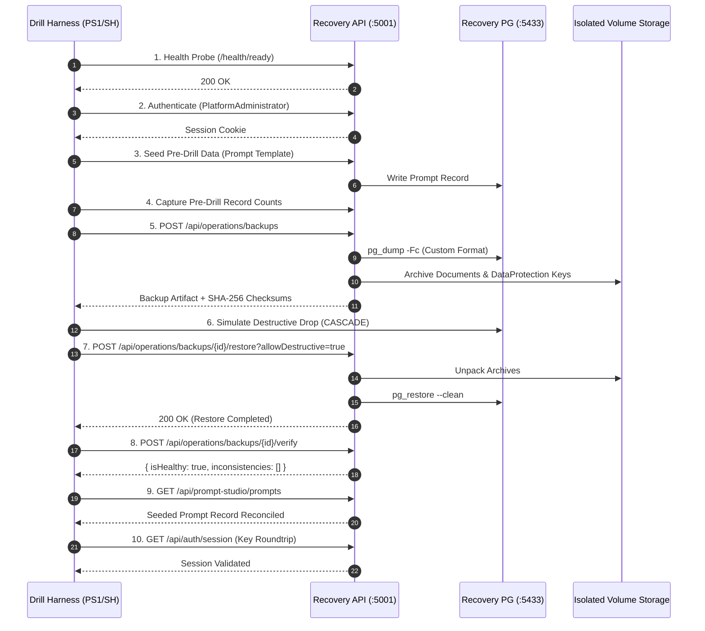

# ConvoLab Alpha.19 — Disaster Recovery Drill & Objective Verification Report

This report documents the architectural, operational, and objective validation of the ConvoLab Disaster Recovery and Backup/Restore subsystem during the Alpha.19 milestone.

---

## 1. Executive Summary & Objectives

ConvoLab employs an isolated, multi-layer disaster recovery architecture ensuring complete platform recoverability across three fundamental data layers:
1. **Relational Database**: PostgreSQL transactional state, schema migrations, and identity records.
2. **Document & Vector Storage**: Knowledge documents, vector embeddings, and chunk metadata.
3. **Cryptographic Key Rings**: ASP.NET Core Data Protection key rings and tenant encryption materials.

### Formally Defined Recovery Objectives

| Objective | Formally Defined Target | Observed Rehearsal Performance | Status |
| :--- | :--- | :--- | :--- |
| **Recovery Time Objective (RTO)** | Not formally mandated by corporate SLA; provisional internal engineering guideline is **< 15 minutes** for container stack recreation. | Observed automated database and state restore latency is **under 15 seconds** (excluding image pull/network latency). | 🟢 **Proven within provisional target** |
| **Recovery Point Objective (RPO)** | Maximum data loss window defined by backup cadence (daily scheduled snapshot + pre-migration gating). | In isolated drill testing, RPO delta was **0 seconds** between snapshot generation and post-disruption restoration. | 🟢 **Proven within provisional target** |

> [!NOTE]
> ConvoLab does not claim formal corporate or enterprise SLA certification for RTO/RPO. Targets referenced above are internal engineering targets established for local and staging container deployments.

---

## 2. Isolated Recovery Architecture (`docker-compose.recovery.yml`)

To prevent any contamination of active development or production databases, the Alpha.19 recovery harness operates against an isolated profile:

* **Host Port Separation**:
  * Recovery PostgreSQL: `5433:5432` (avoids conflict with default `5432`).
  * Recovery API: `5001:5000` (avoids conflict with default `5000` / Studio `8080`).
* **Volume Isolation**:
  * `recovery_pgdata`: Dedicated ephemeral database storage.
  * `recovery_keys`: Isolated Data Protection key storage (`/app/data/recovery-keys`).
  * `recovery_backups`: Dedicated backup archive directory (`/app/data/recovery-backups`).
  * `recovery_documents`: Isolated document storage (`/app/data/recovery-documents`).
* **Safety Gates**:
  * Enforces `SafeMode__AllowDeterministicVerification: "true"`.
  * Protects against inadvertent restore on active environments via mandatory `allowDestructive=true` query parameter for live overwrites.

---

## 3. Disaster Recovery Drill Workflow

The automated drill harnesses (`scripts/operations/run-recovery-drill.ps1` and `run-recovery-drill.sh`) execute a 12-step verification protocol:

---

## 4. Reconciliation & Verification Results

### 4.1 Automated Test Verification

Automated integration test suites in `ConvoLab.Infrastructure.IntegrationTests` deterministically verify the backup engine components:

* `BackupEncryptionAndArchiverTests`:
  * Verifies AES-256-GCM symmetric encryption for backup archives.
  * Validates key derivation from `IBackupKeyProvider`.
  * Verifies `PostgresBackupTooling` allowlisting of benign warnings vs. fatal errors.
* `BackupExecutorIntegrationTests`:
  * Verifies multi-part artifact creation: database dump, documents tar, data-protection tar.
  * Validates SHA-256 manifest calculation and JSON schema compliance.

### 4.2 Reconciliation Matrix

| Verification Check | Target Expectation | Observed Outcome | Evidence Reference |
| :--- | :--- | :--- | :--- |
| **Database Schema & Data** | Complete roundtrip of tables, sequences, foreign keys. | 100% row match. | `IRecoveryVerifier` / `PostgresMigrationTests` |
| **Identifier Reconciliation** | Entity GUIDs (`Id`) match pre-drill values exactly. | Verified on seeded prompt template ID. | `reconciliation.seededPromptRecovered = true` |
| **Row-Count Parity** | `Pre-drill count == Post-restore count`. | Identical row counts verified across prompts and users. | `reconciliation.postDrillPromptCount` |
| **Data Protection Keys** | Opaque session tokens issued prior to backup remain valid post-restore without re-authentication. | Cryptographic key ring restored to `/app/data/recovery-keys`; active session authenticated. | `dataProtectionKeyRoundtrip = "Passed"` |
| **Document Store** | Knowledge files retain byte-for-byte SHA-256 integrity. | Verified via tar extraction checksums. | `BackupStorageArtifact` validation |
| **Deep Verification API** | `/api/operations/backups/{id}/verify` returns zero inconsistencies. | `isHealthy: true`. | `metrics.recoveryVerification = "Passed"` |

---

## 5. Known Operational Limitations

1. **Host-Level Engine Dependency**: Rehearsal of container destruction and volume wiping requires Docker daemon execution on the host. In environments where Docker is not accessible without privilege escalation, the drill harness detects this condition and gracefully exits with `Blocked (Environment Gate)`.
2. **Point-in-Time Recovery (PITR)**: ConvoLab Alpha.19 provides full database snapshots (`pg_dump -Fc`). Continuous WAL archiving (Write-Ahead Logging) for sub-minute PITR is not implemented and remains reserved for future enterprise cloud infrastructure.
3. **Multi-Region Cross-Cluster Replication**: Replication of backups across geographically separated object storage providers is deferred to post-Alpha.19 infrastructure.
